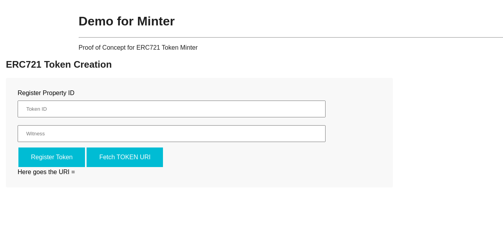

# Udacity Blockchain Capstone

Capstone Project

Contract 'SquareVerifier'
--------------------------
> contract address:    0x8F8e9fAFB101a75916BD7a78E9cc807A4Ec7CA0C

Contract 'SolnSquareVerifier'
------------------------------
> contract address:    0x10F3c26cf517C296C99f3E80cfF2712ee66B6121

Open Sea Bundled Items: https://testnets.opensea.io/bundles/udacity-fji

## Install

To install, download or clone the repo, then:

`npm install`

1. Start Ganache like below .

`ganache-cli -a 20 -l 9999999 -m "candy maple cake sugar pudding cream honey rich smooth crumble sweet treat"` 

2. In a separate terminal window, Compile smart contracts:

    `truffle compile`

    This will create the smart contract artifacts in folder build\contracts.

3. Then compile and deploy with truffle.

`truffle migrate --network development --reset --compile-all`

## Testing
  To run truffle tests from inside the directory eth-contracts/:

`truffle test`

## Minting a Token
Inside client directory

npm run start

To view dapp

`http://localhost:3000`

to register your property, fill property id and click register:

# Project Resources

* [Remix - Solidity IDE](https://remix.ethereum.org/)
* [Visual Studio Code](https://code.visualstudio.com/)
* [Truffle Framework](https://truffleframework.com/)
* [Ganache - One Click Blockchain](https://truffleframework.com/ganache)
* [Open Zeppelin ](https://openzeppelin.org/)
* [Interactive zero knowledge 3-colorability demonstration](http://web.mit.edu/~ezyang/Public/graph/svg.html)
* [Docker](https://docs.docker.com/install/)
* [ZoKrates](https://github.com/Zokrates/ZoKrates)